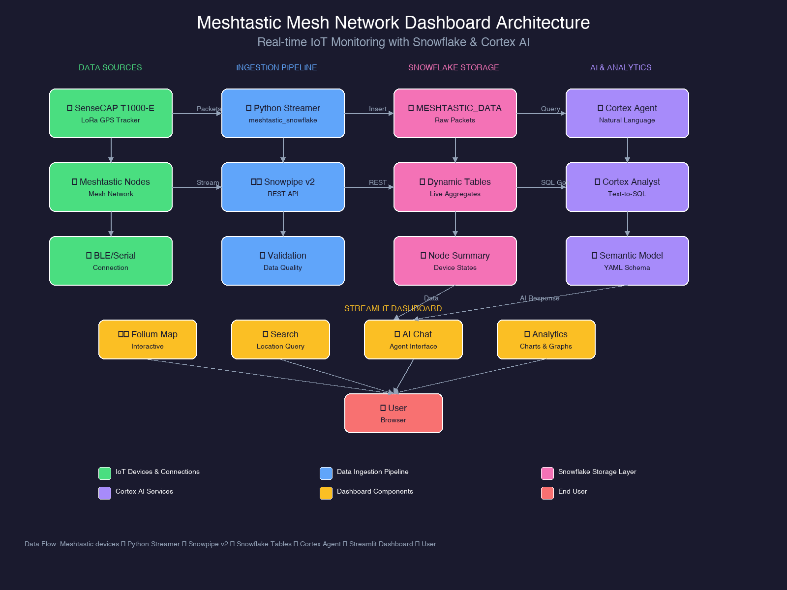

# Meshtastic Mesh Network Dashboard

Real-time visualization and monitoring of Meshtastic LoRa mesh network data streamed to Snowflake via Snowpipe Streaming v2.



## Features

### 🗺️ Interactive Map with Detailed Popups
- **Folium-based interactive map** with multiple base layers (OpenStreetMap, Dark Mode, Satellite)
- **Click-to-view popups** showing comprehensive device information:
  - GPS: latitude, longitude, altitude, speed, satellites
  - Device: battery level (color-coded), voltage, uptime
  - Environmental: temperature (°C/°F), humidity
  - Signal: SNR, RSSI
  - Last seen timestamp
- **Closable popups** - click X or outside to dismiss
- **Marker clustering** for dense node areas
- **Movement tracking** with polyline trails

### 🔍 Location Search
- Search by **address** (geocoded via Nominatim)
- Search by **coordinates** (lat, long)
- **Configurable radius** (5-100km)
- **HAVERSINE distance** calculation to find nearby nodes
- Visual **search radius circle** on map

### 🤖 Cortex Agent Chat Interface
- **Natural language queries** about mesh network data
- Integrated with `DEMO.DEMO.MESHTASTIC_AGENT`
- **Example questions** provided for easy exploration
- **Chat history** preserved during session
- Quick **location-based queries**

### 📊 Comprehensive Analytics
- Device health monitoring (battery, voltage, uptime)
- Environmental sensors (temperature, humidity, pressure)
- GPS quality metrics (satellites, HDOP, PDOP)
- Signal quality distribution (SNR, RSSI)
- Hourly traffic patterns
- Node activity summaries

### 📢 Slack Notifications
- Configurable webhook alerts
- Low battery warnings
- Position updates
- Device offline alerts

## Architecture

```
┌─────────────────┐     ┌──────────────────┐     ┌─────────────────┐
│  SenseCAP       │     │  Python          │     │  Snowflake      │
│  T1000-E        │────▶│  Streamer        │────▶│  MESHTASTIC_    │
│  (LoRa GPS)     │     │  (Snowpipe v2)   │     │  DATA           │
└─────────────────┘     └──────────────────┘     └────────┬────────┘
                                                          │
┌─────────────────┐     ┌──────────────────┐              │
│  Meshtastic     │────▶│  Validation      │              ▼
│  Nodes          │     │  Module          │     ┌─────────────────┐
└─────────────────┘     └──────────────────┘     │  Dynamic        │
                                                 │  Tables         │
                                                 └────────┬────────┘
                                                          │
┌─────────────────┐     ┌──────────────────┐              │
│  Streamlit      │◀────│  Cortex          │◀─────────────┘
│  Dashboard      │     │  Agent           │
└────────┬────────┘     └──────────────────┘
         │
         ▼
┌─────────────────┐
│  User           │
│  (Browser)      │
└─────────────────┘
```

## Installation

### Prerequisites
- Python 3.9+
- Snowflake account with Cortex AI enabled
- Snowflake connection configured

### Install Dependencies
```bash
pip install -r requirements.txt
```

### Required Packages
```
streamlit>=1.30.0
pandas>=2.0.0
plotly>=5.18.0
folium>=0.15.0
streamlit-folium>=0.15.0
snowflake-connector-python>=3.6.0
requests>=2.31.0
```

## Usage

### Run Locally
```bash
# Set your Snowflake connection
export SNOWFLAKE_CONNECTION_NAME=your_connection

# Run the dashboard
streamlit run streamlit_app.py --server.port 8501
```

### Deploy to Snowflake (Streamlit in Snowflake)
```sql
CREATE STREAMLIT DEMO.DEMO.MESHTASTIC_DASHBOARD
  ROOT_LOCATION = '@DEMO.DEMO.STREAMLIT_APPS/meshtastic'
  MAIN_FILE = 'streamlit_app.py'
  QUERY_WAREHOUSE = 'COMPUTE_WH';
```

## Data Schema

### MESHTASTIC_DATA Table
```sql
CREATE TABLE DEMO.DEMO.MESHTASTIC_DATA (
    packet_id STRING,
    from_id STRING,
    to_id STRING,
    packet_type STRING,
    latitude FLOAT,
    longitude FLOAT,
    altitude FLOAT,
    ground_speed FLOAT,
    ground_track FLOAT,
    sats_in_view INT,
    hdop INT,
    pdop INT,
    vdop INT,
    gps_timestamp INT,
    precision_bits INT,
    battery_level FLOAT,
    voltage FLOAT,
    temperature FLOAT,
    relative_humidity FLOAT,
    barometric_pressure FLOAT,
    uptime_seconds INT,
    channel_utilization FLOAT,
    air_util_tx FLOAT,
    rx_snr FLOAT,
    rx_rssi FLOAT,
    text_message STRING,
    channel INT,
    hop_limit INT,
    ingested_at TIMESTAMP_TZ
);
```

## Testing

### Run Unit Tests
```bash
# Run all tests
pytest tests/ -v

# Run specific test file
pytest tests/test_streamlit_app.py -v

# Run with coverage
pytest tests/ --cov=. --cov-report=html
```

### Test Categories
- **Unit Tests**: `tests/test_streamlit_app.py` - Dashboard component tests
- **Validation Tests**: `tests/test_validation.py` - Data validation tests
- **Integration Tests**: `tests/test_meshtastic_streaming.py` - Streaming tests

## Validation Module

The `validation.py` module provides comprehensive data validation:

### Coordinate Validation
```python
from validation import CoordinateValidator

result = CoordinateValidator.validate_coordinates(40.7128, -74.0060)
if result.is_valid:
    lat, lon = result.value
```

### Device Data Validation
```python
from validation import DeviceDataValidator

result = DeviceDataValidator.validate_battery_level(75)
if result.warnings:
    print(result.warnings)  # ["Low battery warning: 15%"]
```

### Node ID Validation
```python
from validation import NodeIdValidator

result = NodeIdValidator.validate_node_id("!abc12345")
assert result.is_valid
```

### DataFrame Validation
```python
from validation import validate_dataframe

df, warnings = validate_dataframe(raw_df)
# Filters invalid coordinates, clips out-of-range values
```

## Cortex Agent Queries

Example questions for the AI Agent:

- "What Meshtastic nodes are active right now?"
- "Show me devices with low battery"
- "What is the network health summary?"
- "Which devices have poor signal quality?"
- "What are the recent GPS positions?"
- "Find nodes near coordinates 40.7580, -73.9855"
- "How many packets were received in the last hour?"

## Configuration

### Environment Variables
| Variable | Description | Default |
|----------|-------------|---------|
| `SNOWFLAKE_CONNECTION_NAME` | Snowflake connection name | `tspann1` |

### Sidebar Settings
- **Time Range**: Filter data by time period
- **Auto-refresh**: Enable 30-second auto-refresh
- **Temperature Unit**: Toggle °C/°F display
- **Slack Notifications**: Configure webhook alerts

## File Structure

```
meshtastic/
├── streamlit_app.py          # Main dashboard application
├── validation.py             # Data validation module
├── generate_diagram.py       # Architecture diagram generator
├── architecture_diagram.png  # System architecture diagram
├── requirements.txt          # Python dependencies
├── README.md                 # This documentation
├── tests/
│   ├── __init__.py
│   ├── test_streamlit_app.py # Dashboard unit tests
│   ├── test_validation.py    # Validation unit tests
│   └── test_meshtastic_streaming.py
├── meshtastic_interface.py   # Device interface
├── meshtastic_snowflake_streamer.py  # Data streamer
└── snowpipe_streaming_client.py      # Snowpipe client
```

## API Reference

### Core Functions

#### `create_folium_map(positions_df, center_lat, center_lon, search_lat, search_lon, search_label)`
Creates an interactive Folium map with device markers.

**Parameters:**
- `positions_df`: DataFrame with device positions
- `center_lat/lon`: Map center coordinates (optional)
- `search_lat/lon`: Search location marker (optional)
- `search_label`: Label for search marker (optional)

**Returns:** `folium.Map` object

#### `get_nodes_near_location(lat, lon, radius_km)`
Find nodes within a specified radius of a location.

**Parameters:**
- `lat`: Latitude of search center
- `lon`: Longitude of search center
- `radius_km`: Search radius in kilometers

**Returns:** DataFrame with nearby nodes and distances

#### `query_cortex_agent(question)`
Send a natural language query to the Cortex Agent.

**Parameters:**
- `question`: Natural language question string

**Returns:** Agent response string

## Troubleshooting

### No Position Data
- Ensure device has GPS lock (outdoor, clear sky view)
- Wait 1-2 minutes for cold start GPS fix
- Verify position broadcasting is enabled

### Map Not Loading
- Check internet connection for tile loading
- Verify `streamlit-folium` is installed
- Check browser console for errors

### Agent Not Responding
- Verify `DEMO.DEMO.MESHTASTIC_AGENT` exists
- Check Cortex AI is enabled in your region
- Review agent permissions

## License

MIT License - See LICENSE file for details.

## Contributing

1. Fork the repository
2. Create a feature branch
3. Add tests for new functionality
4. Submit a pull request

## Support

- **Issues**: GitHub Issues
- **Documentation**: This README
- **Slack**: #meshtastic-alerts (if configured)
