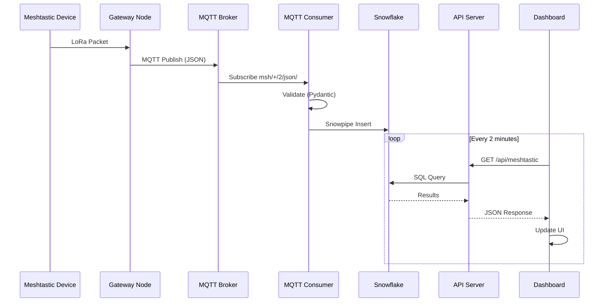

# Meshtastic Dashboard Architecture

## Overview

This document describes the architecture of the Meshtastic Pac-Man Dashboard, a real-time mesh network monitoring system built on Snowflake.

## System Architecture Diagram

```mermaid
flowchart TB
    subgraph Meshtastic["📡 Meshtastic Mesh Network"]
        D1[Device 1<br/>LoRa Radio]
        D2[Device 2<br/>LoRa Radio]
        D3[Gateway Node<br/>WiFi/LTE]
        D1 <-->|LoRa| D2
        D2 <-->|LoRa| D3
    end

    subgraph MQTT["🌐 MQTT Brokers"]
        PUB[Public Broker<br/>mqtt.meshtastic.org]
        PRV[Private Broker<br/>optional]
    end

    subgraph Ingestion["⬇️ Data Ingestion"]
        MC[MQTT Consumer<br/>Python]
        VAL[Validation<br/>Pydantic]
        SPS[Snowpipe Streaming v2]
    end

    subgraph Snowflake["❄️ Snowflake"]
        subgraph Tables["📊 Data Layer"]
            BASE[(MESHTASTIC_DATA<br/>Base Table)]
            SEM[(MESHTASTIC_SEMANTIC_VIEW<br/>Semantic Layer)]
        end
        subgraph Views["👁️ Materialized Views"]
            V1[MESHTASTIC_POSITIONS]
            V2[MESHTASTIC_TELEMETRY]
            V3[MESHTASTIC_MESSAGES]
            V4[MESHTASTIC_ACTIVE_NODES]
            V5[MESHTASTIC_HOURLY_STATS]
            V6[MESHTASTIC_WEATHER]
        end
    end

    subgraph API["🔌 API Layer"]
        FLASK[Flask API Server<br/>Port 5000]
        subgraph Endpoints["Endpoints"]
            E1[/api/meshtastic]
            E2[/api/stats]
            E3[/api/positions]
            E4[/api/semantic/*]
            E5[/api/health]
        end
    end

    subgraph UI["🎮 Dashboard"]
        REACT[React Dashboard<br/>Pac-Man Theme]
        AUTO[Auto-Refresh<br/>2 minutes]
    end

    D3 --> PUB
    D3 -.-> PRV
    PUB --> MC
    PRV -.-> MC
    MC --> VAL
    VAL --> SPS
    SPS --> BASE
    BASE --> SEM
    BASE --> V1
    BASE --> V2
    BASE --> V3
    BASE --> V4
    BASE --> V5
    BASE --> V6
    SEM --> FLASK
    V1 --> FLASK
    V2 --> FLASK
    V3 --> FLASK
    V4 --> FLASK
    V5 --> FLASK
    V6 --> FLASK
    FLASK --> E1
    FLASK --> E2
    FLASK --> E3
    FLASK --> E4
    FLASK --> E5
    E1 --> REACT
    E2 --> REACT
    E3 --> REACT
    E4 --> REACT
    REACT --> AUTO
```

## Data Flow



## Component Details

### 1. Data Sources

| Source | Protocol | Format | Topic Pattern |
|--------|----------|--------|---------------|
| Public Meshtastic | MQTT | JSON | `msh/+/2/json/#` |
| Direct Device | Serial/BLE | Protobuf | N/A |
| Private Broker | MQTT | JSON/Protobuf | Custom |

### 2. Packet Types

| Type | Description | Key Fields |
|------|-------------|------------|
| `telemetry` | Device metrics | battery_level, voltage, temperature |
| `position` | GPS coordinates | latitude, longitude, altitude |
| `nodeinfo` | Device identity | long_name, short_name, hardware |
| `text` | Text messages | text_message |
| `routing` | Mesh routing | hop_limit, hop_start |

### 3. Snowflake Objects

```
DEMO.DEMO/
├── MESHTASTIC_DATA (Table)
│   └── Primary data store for all packets
├── MESHTASTIC_SEMANTIC_VIEW (Semantic View)
│   └── Natural language query layer
├── MESHTASTIC_POSITIONS (View)
│   └── GPS coordinates only
├── MESHTASTIC_TELEMETRY (View)
│   └── Device metrics only
├── MESHTASTIC_MESSAGES (View)
│   └── Text messages only
├── MESHTASTIC_ACTIVE_NODES (View)
│   └── Node summary with last seen
├── MESHTASTIC_HOURLY_STATS (View)
│   └── Hourly aggregations
└── MESHTASTIC_WEATHER (View)
    └── Environmental sensor data
```

### 4. API Endpoints

| Endpoint | Method | Description | Source |
|----------|--------|-------------|--------|
| `/api/health` | GET | Health check | Internal |
| `/api/meshtastic` | GET | Recent packets | MESHTASTIC_DATA |
| `/api/stats` | GET | Aggregated stats | MESHTASTIC_DATA |
| `/api/positions` | GET | GPS data | MESHTASTIC_POSITIONS |
| `/api/telemetry` | GET | Device metrics | MESHTASTIC_TELEMETRY |
| `/api/messages` | GET | Text messages | MESHTASTIC_MESSAGES |
| `/api/nodes` | GET | Active nodes | MESHTASTIC_ACTIVE_NODES |
| `/api/hourly` | GET | Hourly stats | MESHTASTIC_HOURLY_STATS |
| `/api/weather` | GET | Weather data | MESHTASTIC_WEATHER |
| `/api/semantic/metrics` | GET | KPI metrics | MESHTASTIC_SEMANTIC_VIEW |
| `/api/semantic/alerts` | GET | Alert conditions | MESHTASTIC_SEMANTIC_VIEW |

### 5. Dashboard Features

```
┌─────────────────────────────────────────────────────────┐
│  🎮 MESHTASTIC PAC-MAN DASHBOARD                        │
├─────────────────────────────────────────────────────────┤
│                                                         │
│  ┌─────────┐ ┌─────────┐ ┌─────────┐ ┌─────────┐       │
│  │ 👻 50   │ │ 📡 5    │ │ 🟢 91%  │ │ 🌡️ 29°C │       │
│  │MESSAGES │ │ DEVICES │ │ BATTERY │ │  TEMP   │       │
│  └─────────┘ └─────────┘ └─────────┘ └─────────┘       │
│                                                         │
│  ┌─────────────────────────────────────────────────┐   │
│  │  RECENT PACKETS                                 │   │
│  │  ┌──────────┬────────┬──────────┬─────────┐    │   │
│  │  │ TYPE     │ DEVICE │ DATA     │ TIME    │    │   │
│  │  ├──────────┼────────┼──────────┼─────────┤    │   │
│  │  │ 📊 tele  │ !b9d4  │ 🔋91%    │ 16:52   │    │   │
│  │  │ 📍 pos   │ !9c0d  │ 40.67,-73│ 16:51   │    │   │
│  │  │ 📡 node  │ !d7df  │ -19.25dB │ 16:52   │    │   │
│  │  └──────────┴────────┴──────────┴─────────┘    │   │
│  └─────────────────────────────────────────────────┘   │
│                                                         │
│  👻 👻 👻 👻                                            │
│  HIGH SCORE: 5000                                       │
└─────────────────────────────────────────────────────────┘
```

## Security Considerations

1. **MQTT**
   - Public broker uses zero-hop policy
   - No authentication required for public topics
   - Private brokers should use TLS + auth

2. **Snowflake**
   - Connection via named connections (no credentials in code)
   - Role-based access control
   - Semantic views restrict data exposure

3. **API**
   - CORS enabled for local development
   - Input validation via Pydantic
   - Error handling without data leakage

## Monitoring & Logging

### Log Files
```
logs/
├── api_server.log      # Flask API logs
├── mqtt_consumer.log   # MQTT ingestion logs
└── dashboard.log       # Service management logs
```

### Health Metrics
- Snowflake connectivity
- MQTT broker connectivity
- API response times
- Request success rate
- Uptime tracking

## Deployment

### Local Development
```bash
./manage.sh start    # Start all services
./manage.sh status   # Check status
./manage.sh logs     # View logs
./manage.sh stop     # Stop all services
```

### Production Considerations
- Use production WSGI server (gunicorn)
- Enable HTTPS/TLS
- Set up monitoring (Prometheus/Grafana)
- Configure log aggregation
- Use container orchestration (K8s/Docker)
